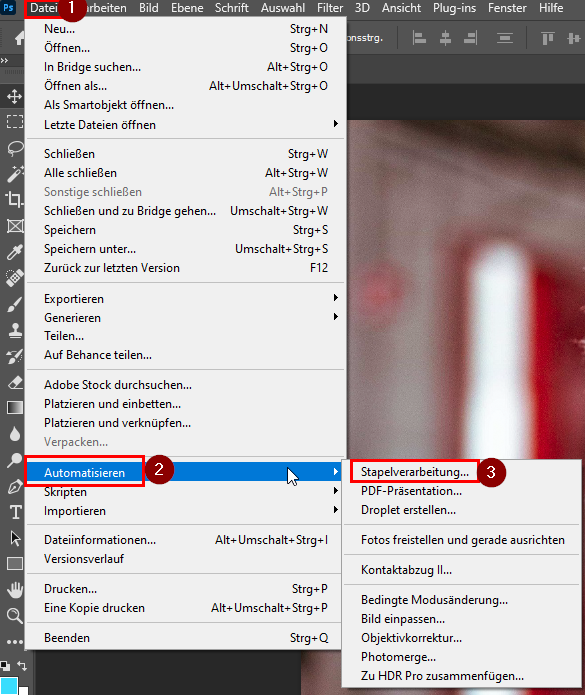
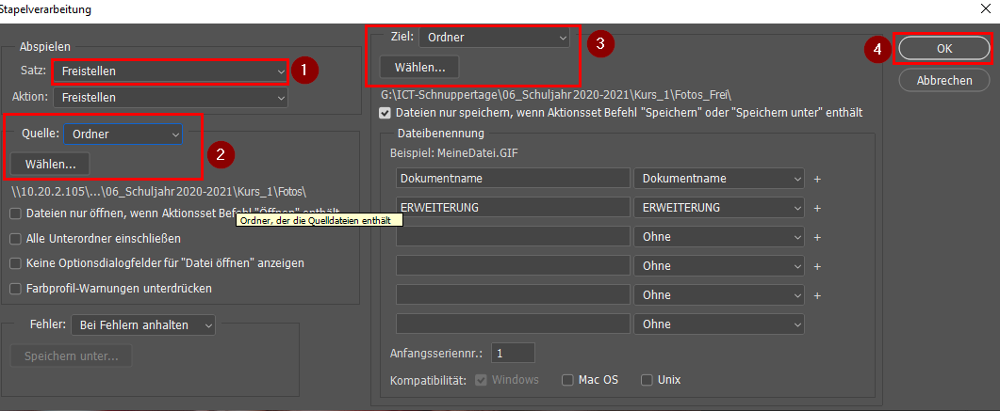
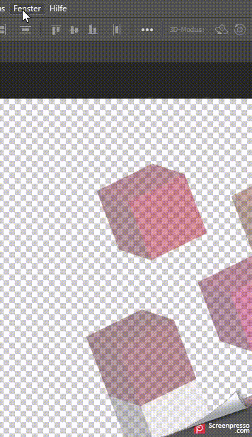
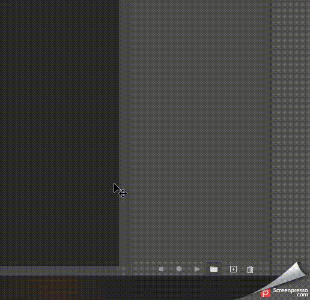
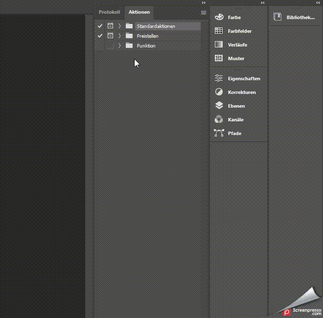

# Photoshop Scripting
Um der ICT-SChnuppertage Prozess zu vereinfachen habe ich ein Skript erstellt welches automatisch alle Bilder in einem `Quell` Verzeichnis bearbeitet. 

Bisher haben wir die Bilder nicht freigestellt, da dies einen zu grossen Aufwand bedeutet hätte. Mit der neuen Freistellfunktion und einem Automatisiertem Skript könnten wir diesen "Service" bieten ohne grossen Mehraufwand.

Dabei werden diverse Efekte angewendet. 

- Freistellen des Bildes
- Automatische Camera RAW settings

## Installation

Für die Installation müssen folgende Dateien Importiert werden: 

- `Freistellen_Inkl_Cameraraw.atn`
- `Freistellen.atn`

Diese werden über einen Doppelcklick automatisch in Photoshop importiert. 

## Anwenden

Im reiter _Datei (1)_ wird das _Automatisations Menü (2)_ geöffnet. 
Hier kann dann die Stapelverarbeitung gestartet werden. 

Im Stapelverarbeitungs Menü wir dann der _Freistellen Satz (1)_ gewählt.
Direkt darunter kann dann das _Quellverzeichnis (2)_ angegeben werden. In der Mitte wird dann das _Zielverzeichnis (3)_ ausgewählt. 
Mit einem Klick auf _*OK (4)*_ werden nun alle Bilder verarbeitet. 

## Erstellen eines eigenen Skriptes

Um eigene Skripts zu erstellen muss die _Aktionen_ funktion hinzugefügt werden. 
Diese ist im Tab _Fenster_ zu finden.

**Diese Funktionen sind unten rechts zu finden.**

Danach wird ein Ordner erstellt. Dieser kann mehrere Funktionen eines Skriptes enthalten. 
Danach muss noch eine _Funktion_ erstellt werden. Nach dem Erstellen wird sofort die Aufzeichnung gestartet. Soimit werden alle Aktionen welche nun gemacht werden aufgezechinet. Mit einem Klick auf das _beenden viereck_ wird die Aufzeichnung gestoppt. Nun ist das Skript fertiggestellt. 

### Skript Export

Das ausgew$hlte Skript kann oben Rechts über die drei Balken exportiert werden. 

## Feedback

Ich habe dies schon vor 3 Jahren einmal versucht. Damals war Photoshop einfach noch nicht genügend ausgereift dazu. 

Das erstellen eines Skriptes war, nachdem ich einige Videos dazu schaute, ganz einfach. 

### Verbesserungsmöglichkeiten
Aktuell benötigt das Skript immernoch knapp 30-45 Sekunden pro Bild (0.45 * 32 = ~14 Min) dies ist immernoch eine Lange Zeit, sicherlich aber schneller als wenn wir es händisch erstelllen würden. 
Dies könnte aber auch an der "Schlechten" Performance meines Surface Pro liegen. 

Auch wäre es noch toll wenn das Zuschneiden auch automatisiert passieren würde. 
Dies scheint aber aktuell noch unmöglich da ein Zentreieren auf das Bild nicht möglich ist. Dafür müssen die Bilder perfekt fotografiert werden. 
